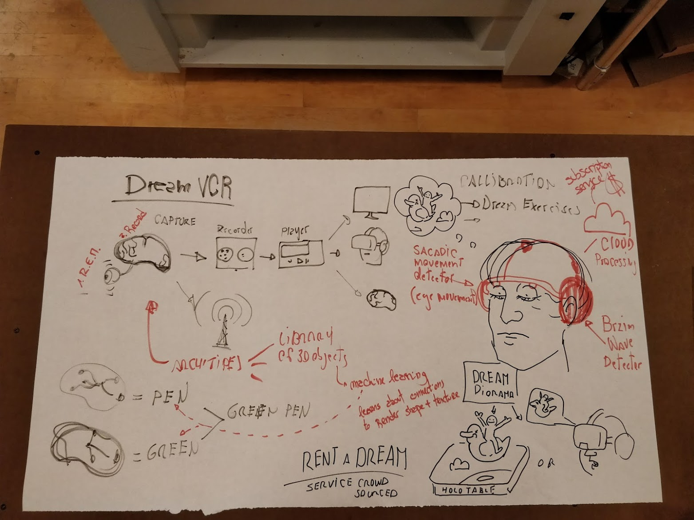

# Intro to Physical Computing - Sept 6

Prof: **[Daniel Rozin](http://www.smoothware.com/danny/)**

### Links
- [Section link](https://itp.nyu.edu/physcomp/itp/sections/danny-rozin/)
- [Slides](https://docs.google.com/presentation/d/1mWAM8oLDh0kVCJZVjFoOw9ZUYaAKDwSBfhyw7fatL2s/edit#slide=id.p)
- [Danny's Work](http://smoothware.com/p5/presentation2/)

### Human and technologic interactions
We are always looking for ways to comunicate better with others. That's why we use technology.  Language has evolved with us, and made us evolve too; and it's not only words!

- speak (language)
- eye contact
- gestures
- touch
- social signifiers (clothing, make up)
- facial expressions
- variations on our voice
- perspiration/sweating
- pheromones
- etc!!!

We can convey all these amazing amount of signals, and we can also perceive them!
But, when we go to tech **our interactions are incredibly limited**. Specially, because devices have also a wide array of output options we don't even think about!! (vibrate, get hot, blow wind, etc!!!) Tech can potentially surpass humans on what can it sense.

How can we widen our own interactions, how can we tap into that enormous potential?

### Interaction process
1. Someone/thing has(?) to initiate an interaction. The output of the initiator part, has to match the input of the receptor in order to be able to actually have an interaction.
2. Do we need to process the input for it to be an interaction? Does a light switch process the press of the button for it to be an interaction?
3. Then there's an output by the receptor, and this becomes the input to the initial emitter. And now it loops!

### Let's design a physical interaction
Design a fantasy machine... How would you interact with it? What pieces would it need?

### [Syllabus](https://itp.nyu.edu/physcomp/itp/syllabus/)

### Assignment
- [Get parts](https://itp.nyu.edu/physcomp/resources/parts-needed-for-physical-computing/)! 😃 (Arduino Uno is fine)
- Email the blog link - specific category!
- Readings (see Syllabus)

The class is not designed to do everything here, but (at least for the beginning) we'll to things together to learn on the spot (and not screw up).

Residents will do workshops EVERY WEEK covering the same material as in class that week, use them! Use office hours! Use resident assistance!
