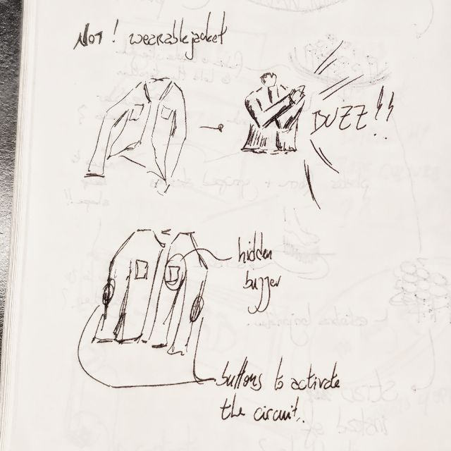
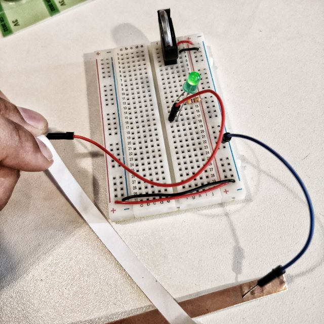
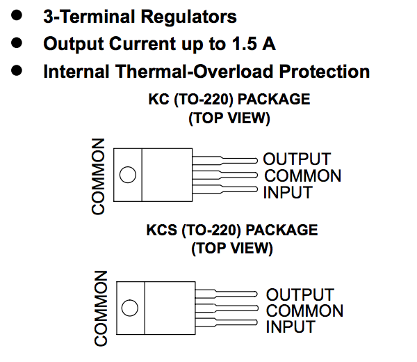
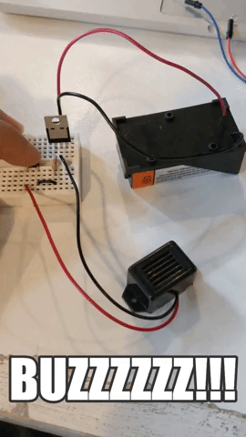
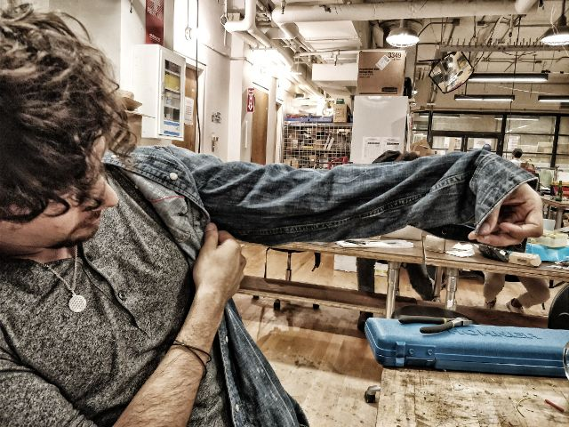
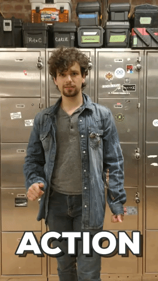
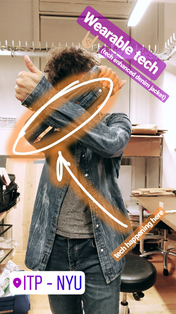

# Physical is wearable: !(NOT!) jacket

I wanted to use this assignment (make a switch) as a chance to explore different interactions and how to enhance human capabilities through technology. This time I used this prompt as a way to enhance my ways of expression, specially my expression of distaste by anything.

I did this by modifying a denim jacket, implanting a battery on the right breast pocket, a buzzer on the left breast pocket and a switch made by two strips of copper tape.

The first thing I had to try was the use of two pieces of copper-tape as a switch. So i just built a small circuit with an LED to see if it worked... and it does perfectly!!

Then, the challenge was getting the buzzer to work. In the beginning I wanted to use a button battery, but the 3V were not enough for the buzzer to work properly. But, as the buzzer only works between 3V and 7V, and the other battery I had is a 9V one, I needed to lower the voltage. The safest way to do so is with a **LM7805 voltage regulator**. I did not remember how to connect them, so I had to look up the corresponding schematics (picture from [Sparkfun](https://www.sparkfun.com/datasheets/Components/LM7805.pdf)).

Only now it was safe to test the buzzer. This new circuit has a simple button, because no one wants a buzzer buzzing around forever without control!

Now it is time to modify my jacket. With some cables and a ton of masking tape to keep everything in place and some precise cable measuring (like I'm doing so skillfully on the picture), I managed to build the entire thing. Of course, I had to rebuild it thousands of times, things did not stick together, soldering failed, etc, etc, etc, I WANTED TO DESTROY EVERYTHING!).

Anyway, somehow I got to build it, and make it work!! The result was awesome and, for projects like these, the interaction is the most important part! So, here it goes! See for yourself!

Last, but not least, it is necessary to post the wonderful result to social media. The sound is too low, so an image will suffice.

