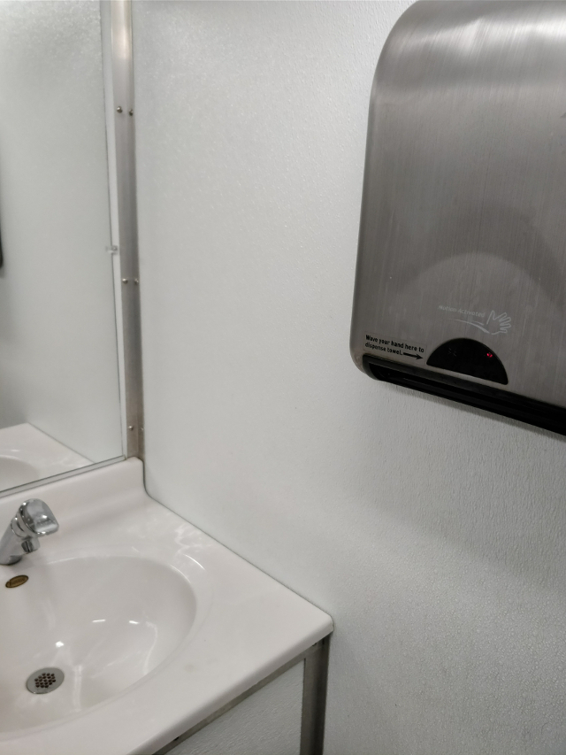
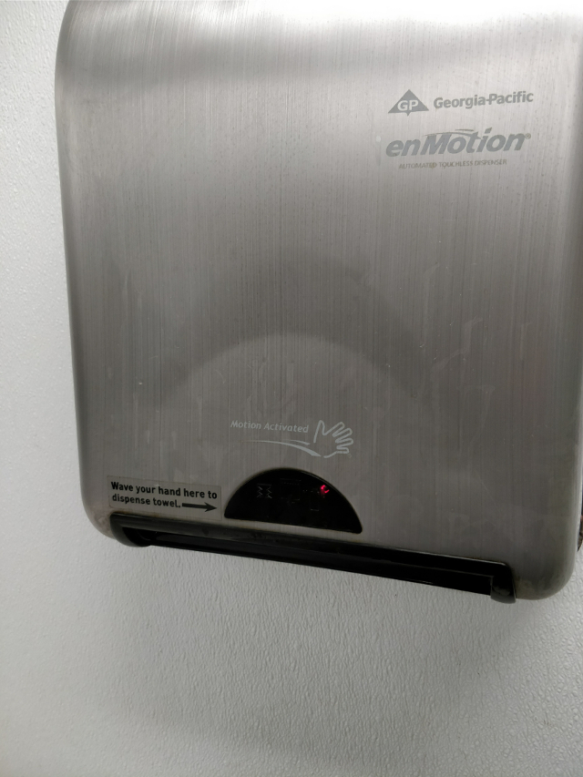

# Interacting is HARD (for some people, at least)

This week we had to observe, a lot. Finding a piece of interactive technology in public that is interesting enough and not as common or obvious was not that easy. Luckily, I came across this particular situation where I was disturbed by the lack of . The particular context can be seen on the following picture.

Yes, it is a bathroom. No, it was not the faucet. Yes, it was the paper towel dispenser. Which had instructions. Written and graphical. You can check them out:

Pretty straightforward, no? You wave in front of the sensor. As the sensor gets interrupted and released again, a paper towel is dispensed. That easy.

But it seems like it was not enough. I could observe people as I was waiting for my turn. And I was dumbfounded. Three men tried to press a non-existing button, touching the whole device and dirtying their hands again in the process. Only one got it right at the first time. Other two tried a combination and due to sheer luck, they managed to get a paper towel. One man even tried pressing a button, and when he didn't find anything, he tried activating another non-existant sensor underneath the device.

This simple transaction, which should take no more than 10 seconds until you have the paper towel in your hands, for a particular person took up to 1 minute, because he needed more than one to get his hands completely dry. Another man resigned and just dried this hands on his pants.

What impressed me the most, is that despite having clear instructions on the instrument, so many people did not bother to look at them, even after failing to get the desired output. Also, there is a small red light that gives away the built in sensor, which may have given some people the idea of a button. But the lack of a physical cue, completely dismisses that idea. Though, that same lack of physicality and tactile feedback might be something that could be improved.

For obvious reasons, I could not record the people interacting with this device (getting the pictures was complicated enough).
